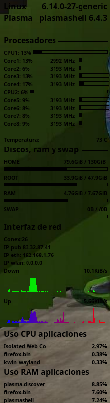

# Configuración de Conky

Este archivo `.conkyrc` define la configuración para **Conky**, un monitor de sistema ligero para GNU/Linux que muestra en el escritorio información en tiempo real sobre el hardware, el sistema operativo, la red y el uso de recursos.

## Contenido del archivo

El archivo se divide en dos grandes secciones:

1. **Parámetros generales de Conky**  
   Configuran la apariencia, el intervalo de actualización y el comportamiento de la ventana de Conky.  
   - `update_interval`: cada cuánto se actualizan los datos (3s).  
   - `own_window`: hace que Conky use su propia ventana, con transparencia.  
   - `alignment`: posiciona el monitor en la parte inferior izquierda de la pantalla.  
   - `font` y `xftfont`: definen la tipografía usada.  
   - `maximum_width`, `gap_x`, `gap_y`: controlan el tamaño y la posición en pantalla.  

2. **Parámetros mostrados en pantalla (bloque `TEXT`)**  
   Secciones que muestran la información en tiempo real:  

   - **Sistema**  
     - Nombre del sistema operativo (`$sysname`).  
     - Versión del kernel (`$kernel`).  
     - Versión de Plasma (ejecutando `plasmashell --version`).  

   - **Procesadores**  
     - Uso general de cada CPU con barras de progreso (`${cpubar}`).  
     - Frecuencia de cada núcleo (`/proc/cpuinfo`).  
     - Temperatura del procesador (`${acpitemp}`).  

   - **Almacenamiento, RAM y Swap**  
     - Estado de las particiones principales (`/home`, `/`).  
     - Uso de memoria RAM y Swap con barras gráficas.  

   - **Red**  
     - Número de conexiones activas (`tcp_portmon`).  
     - Dirección IP pública (obtenida con `wget`).  
     - Dirección IP de interfaces locales (`enp1s0`, `wlan0`).  
     - Velocidad de subida y bajada con gráficas en tiempo real.  

   - **Procesos**  
     - Procesos con mayor uso de **CPU** (`top`).  
     - Procesos con mayor uso de **RAM** (`top_mem`).  

## Dependencias

Para que la configuración funcione correctamente se necesitan:  
- **Conky** instalado en el sistema.  
- Comando `wget` (para obtener la IP pública).  
- Acceso a `/proc/cpuinfo` y `/sys` (normal en Linux).  

## Uso

1. Copiar este archivo como `~/.conkyrc`.  
2. Ejecutar Conky en una terminal:  

   ```bash
   conky


